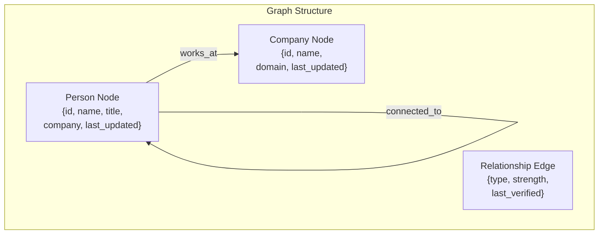
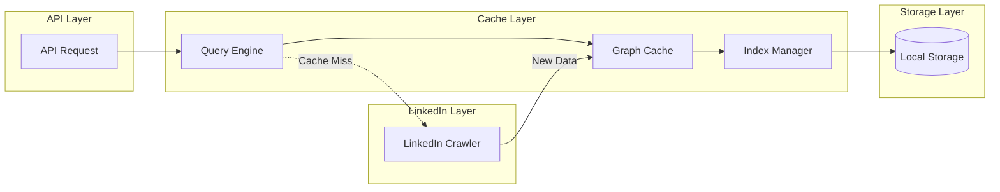
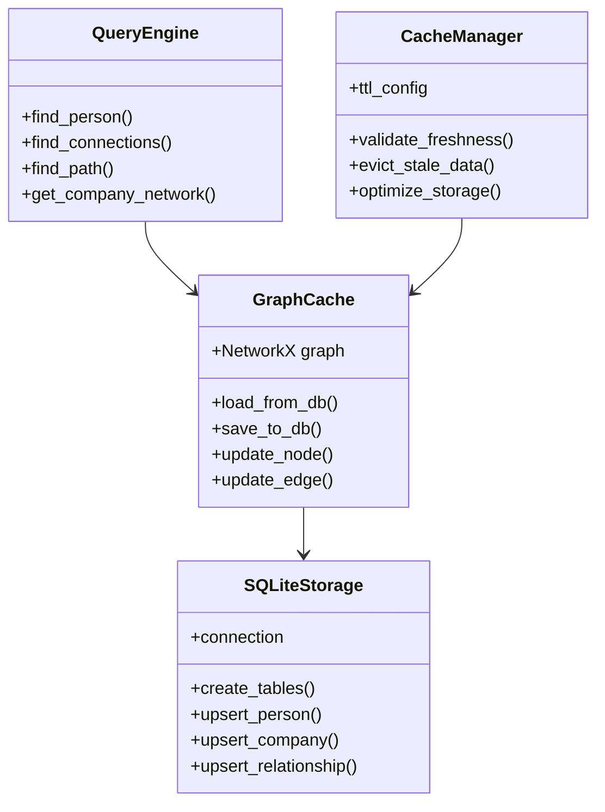

# LinkedIn Network Graph Cache Design

## Problem Statement
The current caching system is request-based rather than entity-based, leading to redundant LinkedIn crawls for the same entities (people, companies, relationships) when accessed through different API endpoints.

## Design Goals
1. Store network data as a persistent local graph
2. Minimize redundant crawls
3. Enable efficient querying of existing relationships
4. Support incremental updates
5. Maintain data freshness
6. Ensure fast read/write operations

## Data Structure

### Graph Structure


### Data Flow


## Implementation Options (Stack Ranked)

### 1. SQLite + NetworkX (Recommended)
**Pros:**
- SQLite provides ACID compliance and efficient querying
- NetworkX offers powerful graph algorithms
- Zero-dependency storage (single file)
- Easy backup and portability
- Excellent community support

**Architecture:**
```python
{
    "storage": {
        "people": SQLite Table,
        "companies": SQLite Table,
        "relationships": SQLite Table
    },
    "runtime": {
        "graph": NetworkX Graph,
        "indices": {
            "name_index": B-tree Index,
            "company_index": B-tree Index
        }
    }
}
```

### 2. Neo4j Embedded + JVM Bridge
**Pros:**
- Native graph database
- Powerful query language (Cypher)
- Built-in graph algorithms
- ACID compliance

**Cons:**
- Heavier footprint
- JVM dependency
- More complex setup

### 3. LevelDB + Custom Graph Implementation
**Pros:**
- Very fast key-value operations
- Low memory footprint
- Good for large datasets

**Cons:**
- No ACID out of the box
- Custom graph implementation needed
- More complex querying

### 4. Pickle + NetworkX
**Pros:**
- Simplest implementation
- Native Python serialization
- Fast for small-medium datasets

**Cons:**
- Not ACID compliant
- Poor concurrent access
- Limited querying capabilities

## Recommended Architecture: SQLite + NetworkX

### Component Design


### Key Components:

1. **Storage Layer (SQLite)**
   - Person table: Stores individual profiles
   - Company table: Stores company information
   - Relationship table: Stores connections and work relationships
   - Indices for fast lookups

2. **Graph Layer (NetworkX)**
   - In-memory graph for fast traversal
   - Lazy loading of subgraphs
   - Path finding algorithms
   - Network analysis

3. **Cache Manager**
   - TTL management
   - Freshness validation
   - Storage optimization
   - Background updates

4. **Query Engine**
   - Graph traversal
   - Path optimization
   - Query planning
   - Result caching

### Data Flow:
1. API request comes in
2. Query engine checks graph cache
3. If data exists and is fresh, return from cache
4. If data missing or stale:
   - Crawl LinkedIn for new data
   - Update graph and SQLite
   - Return results

### Benefits of This Approach:
1. **Persistence**: SQLite provides reliable storage
2. **Performance**: NetworkX offers fast graph operations
3. **Simplicity**: Minimal dependencies
4. **Portability**: Single file database
5. **Flexibility**: Easy to extend and modify

### Implementation Phases:
1. Set up SQLite schema and NetworkX integration
2. Implement basic CRUD operations
3. Add caching logic and TTL
4. Implement graph algorithms
5. Add optimization and maintenance 